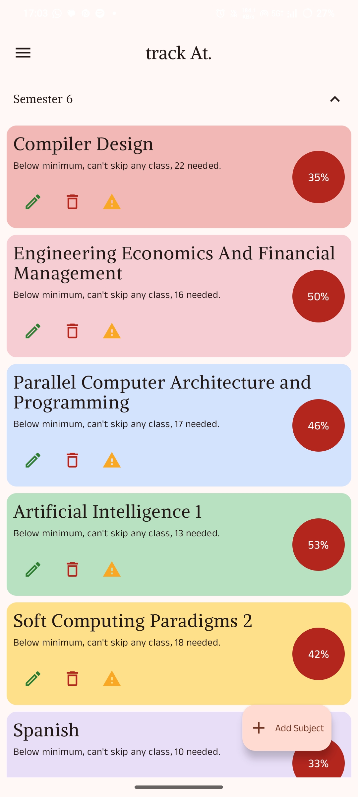
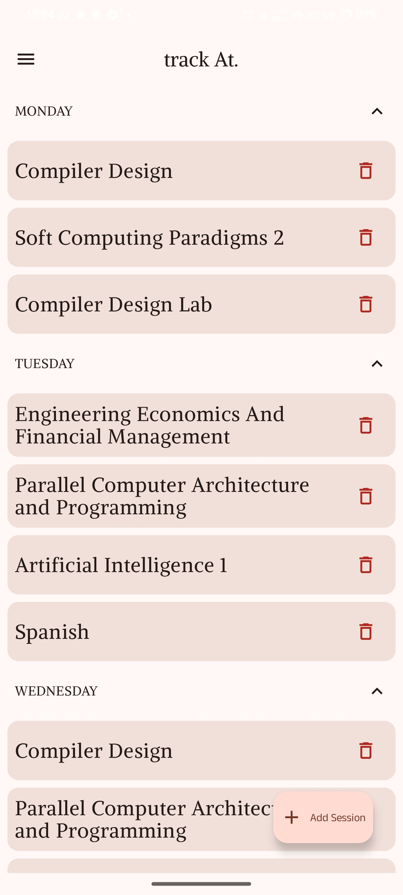
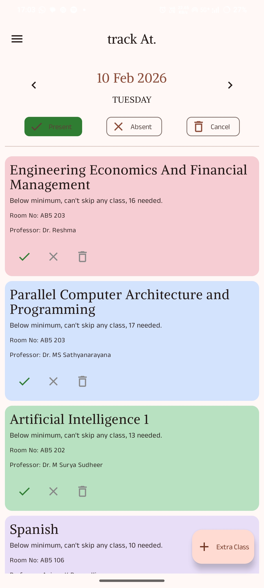
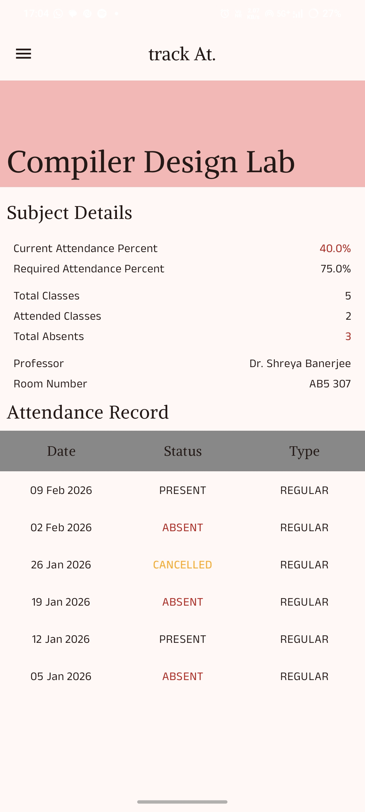
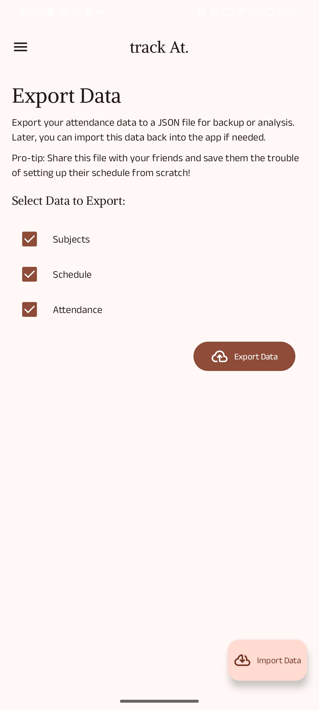

# 📚 track-At.

**track-At** is a modern, intuitive Android application designed to help students and professionals
effortlessly manage their daily attendance. Built with the power of **Jetpack Compose**, it combines
a sleek UI with robust functionality to keep you on top of your schedule. 🚀

## ✨ Features

- **🎓 Subject Management**: Create, edit, and reorganize subjects with ease. Customize them to fit
  your curriculum.
- **📅 Smart Scheduler**: Set up your weekly timetable and let the app remind you of upcoming
  classes.
- **✅ Quick Marking**: Mark attendance (Present, Absent, or Cancelled) with just a few taps from the
  Day View.
- **📊 Insightful Statistics**: View real-time attendance percentages. Know exactly how many classes
  you can afford to miss or need to attend to hit your targets.
- **🗓️ Day View**: A focused view of your daily schedule to manage attendance record-by-record.
- **🌗 Dark & Light Mode**: Seamlessly adapts to your system theme for a comfortable viewing
  experience day or night.
- **☁️ Import-Export**: Backup your data before you loose it, or simply share it with your mates to spare them the trouble of setting up the app.


## 🛠️ Tech Stack

This project leverages the latest in Modern Android Development (MAD):

- **Language**: [Kotlin](https://kotlinlang.org/) ⚡
- **UI Framework**: [Jetpack Compose](https://developer.android.com/jetpack/compose) (Material 3) 🎨
- **Dependency Injection**: [Hilt](https://dagger.dev/hilt/) 💉
- **Local Database**: [Room](https://developer.android.com/training/data-storage/room) 🗄️
- **Navigation**: [Jetpack Navigation Compose](https://developer.android.com/guide/navigation/navigation-compose)
  🧭
- **Architecture**: MVVM (Model-View-ViewModel) 🏗️

## 📸 Screenshots

<p align="center">
  <!-- Upload your screenshots to a folder named 'screenshots' in your repo and link them here -->
  
  
  
  
  
</p>

## 📲 Installation

### Option 1: Download APK

Grab the latest compiled APK directly from the **[Releases Section](https://github.com/Jaguar000212/track-At./releases)** of this repository.

### Option 2: Build from Source

If you're a developer or want to contribute:

1. **Clone the repository:**
   ```bash
   git clone https://github.com/Jaguar000212/track-At..git
   ```
2. **Open in Android Studio:**
   File → Open → Select the `AttendanceTracker` folder.
3. **Sync & Run:**
   Wait for Gradle to sync dependencies, then hit **Run** ▶️ on your emulator or physical device.

## 🤝 Contribution

Contributions make the open-source community an amazing place to learn, inspire, and create. Any
contributions you make are **greatly appreciated**! ❤️

1. Fork the Project
2. Create your Feature Branch (`git checkout -b feature/AmazingFeature`)
3. Commit your Changes (`git commit -m 'Add some AmazingFeature'`)
4. Push to the Branch (`git push origin feature/AmazingFeature`)
5. Open a Pull Request

## 📄 License

Distributed under the MIT License. See `LICENSE` for more information.

---
⭐️ From [Jaguar000212](https://github.com/Jaguar000212)
